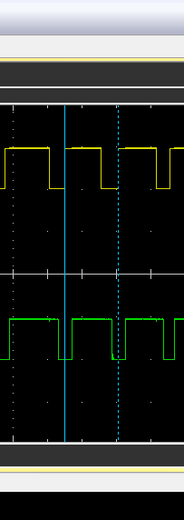
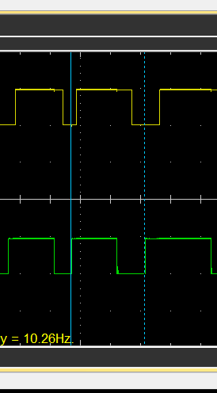

# Rotary Encoders
## Pinout
```
-- Clock
-- Data
-- Switch
-- Vcc
-- Gnd
```
## Traces
Rotating clockwise:



In clockwise rotation, the clock pulse happens first, then the data pulse. In the above trace, the yellow probe is connected to the clock pin, and the green probe is connected to the data pin.

Rotating counter-clockwise:



In counter-clockwise rotation, the data pulse happens first, then the clock pulse. In the above trace, the yellow probe is connected to the clock pin, and the green probe is connected to the data pin.

## Reading the encoder
As a non-deterministic input method, I think this is going to need to use IO pins that can trigger an interrup, then an ISV is going to be needed to track the state of the pins.
